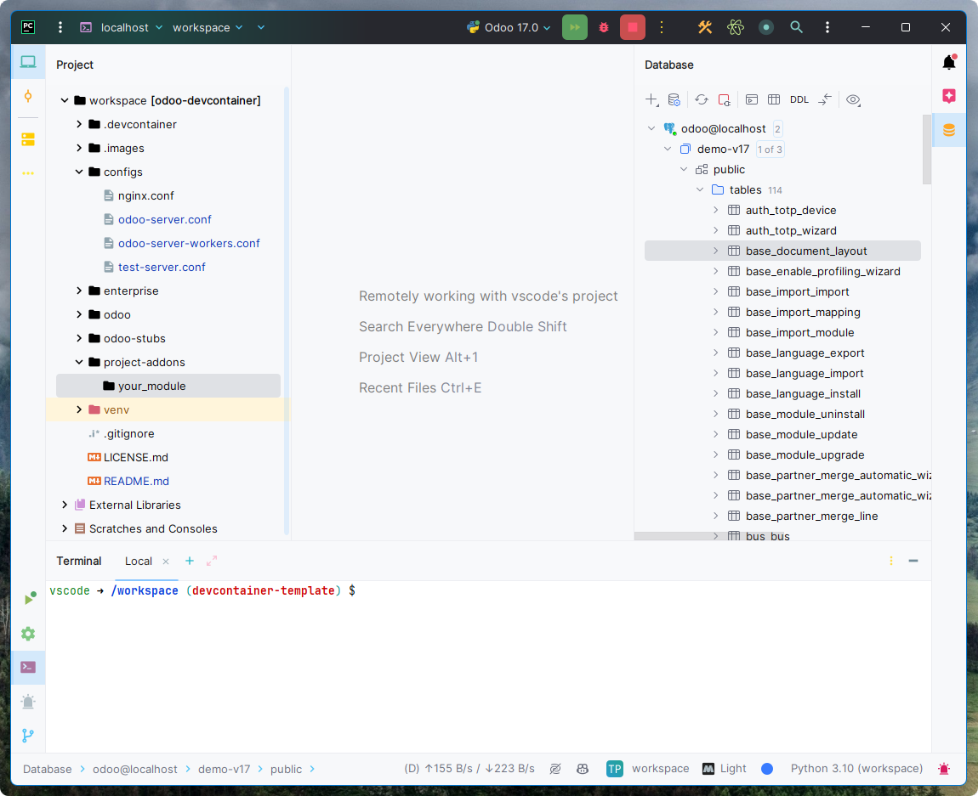
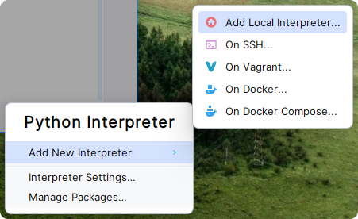
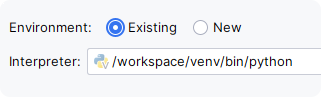
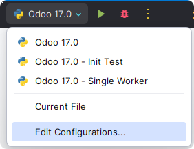
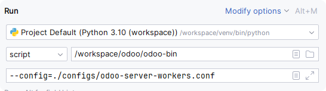
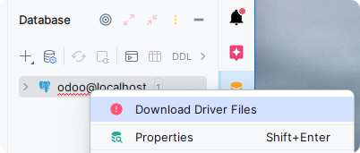
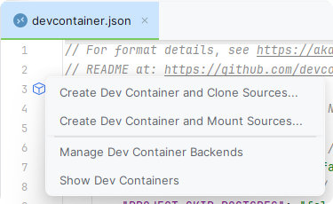

# Odoo Dev Container



## Overview
"Works on my machine"

Odoo DevContainer works to eliminate this problem by creating a portable and standardized development environment for 
Odoo by using a Docker container. When you use a devcontainer with PyCharm Professional, an agent is installed into the 
container that allows you to interact with the file system "remotely" from your host machine.

This devcontainer will take care of the pain of setting up a local Odoo development environment, including:
- Automatically pulling the Odoo and Enterprise (if you have access) repos
- Automatically installing Python dependencies and creating a venv.
- Installing Postgres and Nginx
- Setting up run configurations in PyCharm for Odoo
- Setting up database connections in PyCharm for Postgres

You can use JetBrains Gateway or PyCharm Professional to build and run this devcontainer.

For use on a project, I recommend forking or cloning this repo and making changes to suit your team's needs. 

After building the devcontainer using PyCharm or JetBrains Gateway, you will have the following project structure:

```bash
workspace/
 ├── .devcontainer/               # Dev container configuration files and scripts
 │   └── devcontainer.json        # The devcontainer configuration.
 │   └── Dockerfile               # The Dockerfile used to build the image.
 │   └── pre-setup.sh             # Script that runs on container creation, pulls the repos, and installs pip dependencies.
 │   └── extra-repos.sh           # Script for pulling additional repos needed for your project, like custom addons.
 │   └── post-attach.sh           # Script that runs after attaching IDE to container, starts Postgres and Nginx.
 │   └── pycharm-tools.sh         # External tools for PyCharm to run commands to terminate hanging processes.
 ├── configs/
 │   └── nginx.conf               # Nginx configuration file
 │   └── odoo-server.conf         # Single worker configuration file
 │   └── odoo-server-workers.conf # Multi worker configuration file
 │   └── test-server.conf         # Config file for running unit tests
 ├── enterprise/        # Enterprise repo (if you have access)
 ├── odoo/              # Odoo repo
 ├── project-addons/    # Your project's addons if you modify the .devcontainer/extra-repos.sh file
 └── README.md          # You are here
```

## Prerequisites
- [Docker](https://www.docker.com/)
- [PyCharm Professional](https://www.jetbrains.com/pycharm/) >= 2023.3.2 or [JetBrains Gateway](https://www.jetbrains.com/remote-development/gateway/) >= 2023.3.2 (Requires PyCharm Professional License)
- SSH keys set up in your user's .ssh directory for cloning private repositories.
- For Windows users: Ensure the OpenSSH Authentication Agent service is running and your SSH key is added to the agent.

## Setup
### Building the Dev Container
1. Open PyCharm Professional or JetBrains Gateway.
2. Navigate to Remote Development (If you are alreay inside a project, click File > Remote Development)
3. Click the New Dev Container button.
4. Select the Docker server you want to use, should default to your local Docker server.
5. Copy and paste the git repo URL into the Git Repository field. (This repo's URL or your forked repo's URL)
6. Select the branch (version of Odoo) you want to use.
7. Click Build Container and Continue.
8. Wait for the container to build.
9. Once the container is ready, you should make sure to select PyCharm as your IDE (especially if using JetBrains Gateway).

### Configuring the Project Interpreter
The container should have prepared a venv for you automatically, but you will need to select it as the project interpreter within PyCharm.
1. If in the lower right corner you see <No interpreter>, click on it.



2. Click Add new interpreter > Add Local Interpreter.



3. On the Add Python Interpreter screen, select Existing > Click Ok.

#### Configuring the Run Configurations


1. Next you'll need to set the interpreter on the built-in Run Configurations.
2. From the PyCharm main screen, to the left of the Run button, click the dropdown menu and click Edit Configurations.
3. Select one of the Run Configurations for Odoo.



3. If you see <No interpreter>, click on it and select the interpreter you just configured.

### Configuring the Database Connection
The container should have set up a database connection for you automatically, but there is a couple of manual steps 
required to get the database driver installed and password authenticated.
1. From the PyCharm main screen, click the Database icon on the upper right side of the screen.
2. From the database pull out, you should see a connection to the Postgres database.



3. Right click on the connection and click Download Driver Files.
4. The database drivers download and install very quickly.
5. Right click again, and click Properties. 
6. In the password field, enter the default password, odoo. Click Ok.

### Unshallowing Odoo/Enterprise Repos
To speed up the build of the devcontainer, the Odoo and Odoo Enterprise repos are cloned with a depth of 1. This means that only 
the most recent commit is pulled. If you need the full history, you can unshallow these repos.

Using the terminal in PyCharm, run the following commands (this will take a long time):
```
cd /workspace/odoo
git fetch --unshallow
cd /workspace/odoo-enterprise
git fetch --unshallow
```

## Customizing the Dev Container

1. **Clone and Modify**: Clone this repository and make your desired changes to the files within the .devcontainer 
directory.
2. **Add Custom Repositories**: Include your custom repositories in the _./devcontainer/extra-repos.sh_ file.



3. **Testing Customizations**: In PyCharm, when you edit the devcontainer.json file, a block icon appears near the 
opening curly bracket. Click this to access customization options. Select **_Create Container and Mount Sources_** for PyCharm 
to rebuild the container with your changes, using a bind mount to include the current project directory.
4. **Considerations for Windows and macOS Users**: Be aware that using **_Create Container and Mount Sources_** on Windows and 
macOS may lead to I/O performance issues due to the containers running within a VM. This can make bind mounts less 
efficient. While this method is suitable for testing container customizations, for day-to-day development, particularly 
on Windows and macOS, use _**Create Container and Clone Sources**_ instead, which will put your source code in a volume. 
This approach avoids the noted I/O issues. More details can be found in [Visual Studio Code's performance improvement guide](https://code.visualstudio.com/remote/advancedcontainers/improve-performance#_use-a-targeted-named-volume).

#### Environment Variables
- **PROJECT_SHORT_NAME**: Shortcode for the project, used in config files and domain names.
- **PROJECT_VERSION**: Odoo version to install. Make sure to set on both build args and containerEnv.
- **PROJECT_SKIP_ENTERPRISE**: Set to true to skip cloning the Odoo enterprise repo.
- **PROJECT_SKIP_POSTGRES**: Set to true to skip starting Postgres on attach.
- **PROJECT_SKIP_NGINX**: Set to true to skip starting Nginx on attach.
- **PROJECT_KEEP_DOTGIT**: Set to true to keep the .git directory when bind mounting locally.

#### Extra Repos
The extra-repos.sh file is used to clone additional repositories into the container.

## Roadmap
- [ ] Fix issue in v17.0 where longpolling socket is not working.
- [ ] Transition to using plain Ubuntu base image instead of Microsoft's devcontainer base image.
- [ ] Implement "customizations" section to devcontainer.json. [BLOCKED]

## License
This project is licensed under the MIT License - see the [LICENSE.md](LICENSE.md) file for details.

